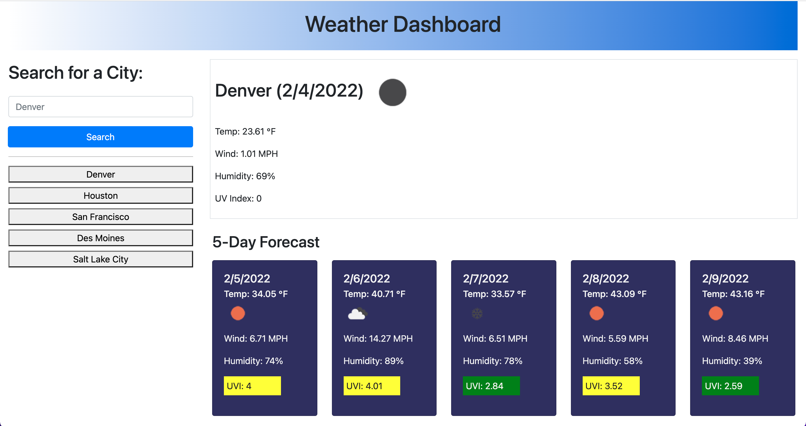

# Weather Application

## Description

This application allows its users to search for the name of a city and see the current weather as well as a five-day forecast.

It leverages the One Call free API and was my first experience calling out to a third party API.

This exercise was a lot of fun and it helped me get more familiar with the fetch function as well as API endpoints, URL parameters, and API keys.

## Installation

This application does not need to be installed. The live application can be found [here](https://cleave13.github.io/weather-app/).

The source code can also be accessed [here](https://github.com/cleave13/weather-app).

## Usage

To use this application, navigate to the main screen and search for a city name. When you clik "search" the app will callout to the One Call weather API, retrieve the weather data and display it for the user.

## Credits

I used Bootstrap version 4.3.1 for the CSS styling and many of the components. See the documentation [here](https://getbootstrap.com/docs/4.3/getting-started/introduction/).

I also leveraged the [One Call API](https://openweathermap.org/) for all of the weather callouts.
